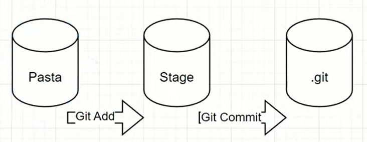
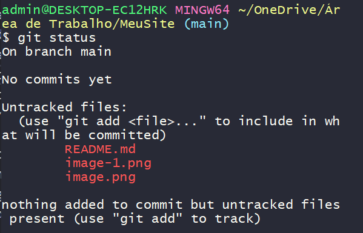
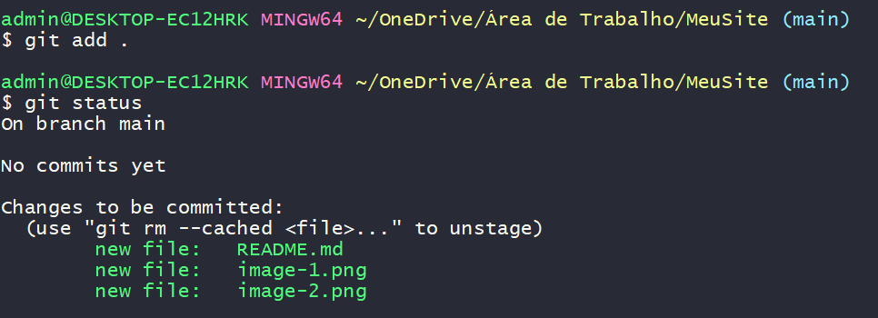

# DIO | Resumos Git e GitHub

Repositório para armazenar resumos sobre Git e GitHub do curso Versionamento de Código com Git e GitHub da [Digital Innovation One](https://www.dio.me)

## 📚 Documentação
- [Documentação Git](https://git-scm.com/doc)
- [Documentação GitHub](https://docs.github.com/)

## 💻 Resumos das Aulas
|  Aulas    |  Resumos   |
|-----------|------------|
| Aula 01   | [Resumo]() |
| Aula 02   | [Resumo]() |








```
git config --global user.name nome_do_usuario
git config --global user.name email_do_usuario

ex.:
$ git log
commit ef79ff128d99d30a5cd740039a63046a13a5cac9 (HEAD -> main, origin/main)
Author: Mike <marcusmagina@gmail.com>
Date:   Fri Aug 30 21:51:09 2024 -0300

    Update README.md

- git init (inicializa o repositório para versionamento)
- git add <file>... (inclui arquivo para versionamento)
- git status
git restore --staged <file>... to unstage
git commit -m "breve descrição do que foi feito"
git checkout
git branch 
git merge <nome da branch>
git remote add origin https://github.com/MikeDevRJ/dio-resumos-git-e-github.git
git push -u origin main
git clone
git pull origin
```

## 🔍 Referências
- [Digital Innovation One](https://www.dio.me)
